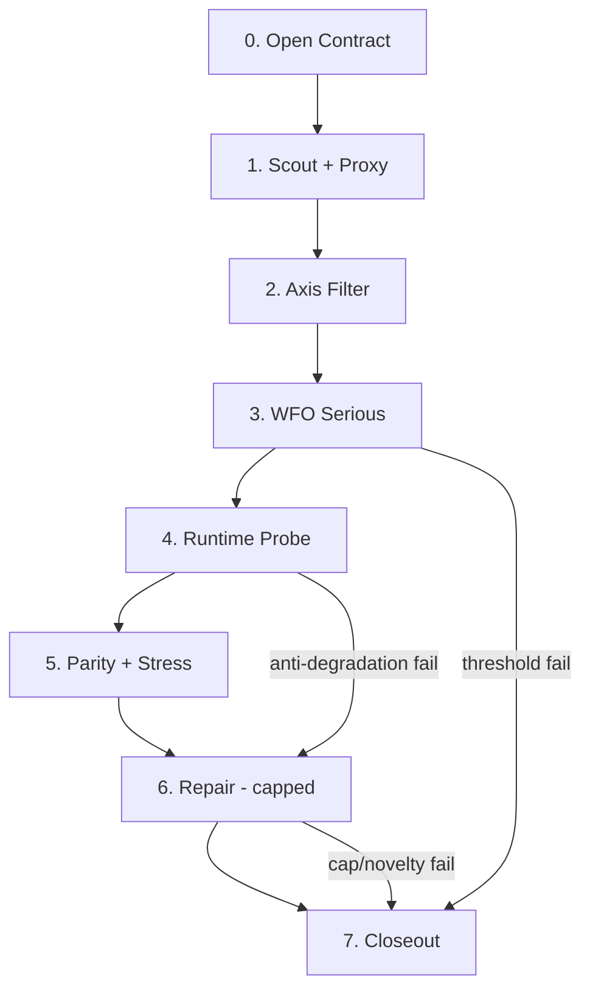

프론티어 단계 범위를 가설 생명주기 하나로 묶는 모델을 검토하기 위해, 관련 거버넌스 문서와 현재 작업 상태를 먼저 확인합니다.
# Grok Medium Review — Frontier Stage as One Hypothesis Lifecycle

**Review size:** medium review (중간 검토)
**Role:** external second opinion (외부 2차 의견) only — Codex owns final direction, local verification, claim boundary
**Claim boundary:** consulting only — no training, MT5 execution, baseline, promotion, runtime authority, live readiness, Goal Achieve

---

## 한 줄 결론

**Accepted with revision(수정 수용):** 사용자가 선호한 모델 — **하나의 frontier stage = 하나의 가설 생명주기** — 가 기본 단위(default frontier stage unit)로 더 낫다.

이전 조언에서 `frontier02 = scout/WFO only`, `frontier03 = MT5/parity/stress`로 **단계를 쪼개자**고 한 부분은 **부분 거절(partially rejected)**한다. 쪼개야 할 것은 **단계 경계(stage boundary)**가 아니라 **단계 안의 packet(작업 묶음)과 proof ladder rung(증명 사다리 단계)**이다.

핵심 구분:

| 레이어 | 무엇을 묶는가 | 예 |
|---|---|---|
| **Frontier stage** | 하나의 `frontier_thesis(전선 가설)` | "L4 hold-margin + curve pocket ONNX variant" |
| **Packet / run** | ladder 안의 한 실행 단위 | `frontier02C_mt5_runtime_probe_v1` |
| **Claim label** | 지금 무엇이 증명됐는가 | `seed_surface`, `runtime_probe_observation` |

효과: scout/WFO가 유망해 보이다가 MT5에서 깨지는 경우, **같은 가설 맥락 안에서** repair → negative closeout(부정 마감)까지 닫을 수 있다. 인위적 handoff(넘김)로 runtime failure(런타임 실패)가 다음 단계로 밀려 context(맥락)가 끊기는 일을 줄인다.

---

## 1. 사용자 선호 모델이 더 나은가?

**판정: accepted**

이유는 세 가지다.

**A. `frontier_governance.md`의 repair rule(수리 규칙)과 맞는다.**
Repair는 기본적으로 same-stage packet(동일 단계 작업 묶음)이다. scout/WFO를 frontier02에서 끊고 MT5를 frontier03으로 넘기면, **같은 가설의 수리**가 어느 단계 소유인지 모호해진다.

**B. Stage12–364의 실패 패턴을 반복하지 않게 한다.**
과거는 "한 축 고치기 → 다른 축 깨짐 → 새 단계 번호"가 repair loop(수리 반복)를 숨겼다. 가설 단위로 닫으면 **decision weight(결정 무게)**가 한 곳에 모인다.

**C. `reference, not inheritance(참조이지 상속 아님)`와 충돌하지 않는다.**
한 stage가 길어져도 prior winner(이전 승자)를 상속하지 않는다. stage가 길다고 authority(권위)가 생기지 않는다.

**단, 예외 2개는 유지한다.**

1. **`stage_frontier_01`은 가설 stage가 아니다** — archive synthesis(보관소 종합) + axis lock(축 고정) 전용. 여기에 proxy/WFO/MT5를 넣으면 안 된다.
2. **한 stage에 여러 독립 가설을 넣으면 안 된다** — lane parallel scout(노선 병렬 탐색)는 허용하되, **하나의 frontier_thesis** 아래 parallel candidates(병렬 후보)여야 한다. "7 lanes 중 살아남은 것 아무거나"는 가설이 아니라 **portfolio sweep(포트폴리오 훑기)**다.

---

## 2. 이전 stage split을 어떻게 고칠 것인가?

**판정: 이전 split rejected; revised model accepted**

| 이전 계획 | 새 권고 |
|---|---|
| `frontier02` = scout + WFO shortlist만 | `frontier02` = **하나의 ONNX 가설** 전체 lifecycle |
| `frontier03` = MT5/parity/stress | **삭제** — frontier02 안의 packet sequence로 흡수 |
| stage 번호 = proof ladder rung | stage 번호 = **가설 번호**; ladder는 stage 내부 |

### 수정된 frontier numbering(번호 체계)

```text
stage_frontier_01  →  archive synthesis + axis lock (특수, 가설 아님)
stage_frontier_02  →  Hypothesis H1: [구체 가설 한 문장]
stage_frontier_03  →  Hypothesis H2: [새 가설]
...
```

`frontier02`의 subtitle(부제) 예:

`stage_frontier_02__hold_margin_curve_pocket_onnx`

내부 packet 예:

```text
frontier02A_scout_proxy_sweep_v1
frontier02B_wfo_serious_shortlist_v1
frontier02C_mt5_runtime_probe_v1        ← 이전에 frontier03으로 빼던 것
frontier02D_runtime_parity_v1
frontier02E_interval_expansion_stress_v1
frontier02F_repair_[specific_break]_v1  ← 필요 시, cap 안에서
frontier02G_closeout_adversarial_v1
```

**모든 scout clue가 MT5까지 가지 않는다.** `frontier02B` exit(종료)에서 **predeclared threshold(사전 근거 기준)** 미달 후보는 `negative_memory(부정 기억)` 또는 `seed_surface(씨앗 표면)`로 stage를 일찍 닫거나, 같은 stage 안에서 **early negative closeout(조기 부정 마감)** 한다. MT5 비용은 **WFO serious survivor(진지 생존 후보) 이상**만 쓴다.

---

## 3. Frontier stage 안의 exact lifecycle(생명주기)

**판정: accepted — 아래 7-phase model 권고**

각 frontier stage(가설 stage)는 **고정 7-phase skeleton(7단계 골격)**을 쓴다. phase는 packet sequence(작업 순서)이지, 별도 stage 번호가 아니다.



| Phase | 이름 | Gate | Output label ceiling |
|---|---|---|---|
| **0** | Open contract | `frontier_thesis`, `novelty_delta`, `exit_rule`, `claim_boundary` | — |
| **1** | Scout + proxy | invalid filter only (no hard gate) | `scout_clue` |
| **2** | Axis filter | distinguishability, sample floor | `axis_survivor` |
| **3** | WFO serious | joint_pass_count ≥ 1, curve pocket audit | `seed_surface` → `wfo_serious_survivor` |
| **4** | MT5 runtime probe | anti-degradation rule | `runtime_probe_observation` |
| **5** | Parity + interval stress | parity evidence + DD on expanded intervals | `runtime_parity_candidate` → `interval_stress_survivor` |
| **6** | Repair (capped) | same hypothesis, same source/label/runtime repr | prior label only, no upgrade |
| **7** | Closeout | decision-weight checklist | `negative_memory` / `seed_surface` / `onnx_completion_candidate` / `blocked` |

### Phase skip rules(건너뛰기 규칙)

- Phase 1–2 실패 → Phase 7로 **early negative closeout** (MT5 안 감)
- Phase 3 실패 → repair가 **같은 label/horizon/feature surface** 안이면 Phase 6; 아니면 Phase 7 + next frontier proposal
- Phase 4–5는 **serious survivor 1–3개**에만 — 전체 scout pool(탐색 풀)에 MT5 금지

### Closeout labels(마감 라벨) — operating authority 제외

Stage는 아래 중 **하나 이상**으로 닫을 수 있다. `operating_authority(운영 권위)`는 별도 operating packet 없이는 불가.

- `negative_memory` — 가설이 틀렸거나 실행 불가
- `invalid_setup` — 설정/데이터/parity 자체가 무효
- `blocked_retry_condition` — 환경/도구 부재
- `seed_surface` — WFO에서 씨앗은 있으나 runtime/stress 미통과
- `runtime_probe_observation` — MT5 관찰만, completion 아님
- `onnx_completion_candidate` — 4축 aspiration zone 근접, final review 대기
- `onnx_completion` — **전용 adversarial packet** + full 11-layer evidence stack

---

## 4. Escalation rules(격상 규칙): same-stage repair → new frontier stage

**판정: accepted**

### Same-stage repair stays(동일 단계 유지) when ALL true:

1. `frontier_thesis` 문장이 바뀌지 않음
2. `source`, `label`, `runtime representation` 중 **바뀐 것이 0–1개**이고, 바뀐 것이 **수리 범위(repair boundary)** 안에 선언됨
3. Repair count ≤ **2 packets** per break class(고장 유형당)
4. Total repair packets ≤ **4** per frontier stage
5. Novelty check: "이 수리가 새 실험인가, 같은 실험 반복인가?" → 반복이면 escalate

### Escalate to new frontier stage when ANY true:

| Trigger | Example |
|---|---|
| **T1** Source/label/runtime repr **2개 이상** 동시 변경 | horizon + margin + calibration 동시 변경 |
| **T2** Exit rule 발동 | "3 serious survivor 모두 MT5 anti-degradation fail" |
| **T3** Repair cap 초과 | 5번째 repair packet |
| **T4** Novelty delta 없는 repair chain | "DD만 줄이기" 3회 반복, density/PF/curve 무변화 |
| **T5** Validation philosophy change | proxy-only → MT5-first로 전략 전환 |
| **T6** Thesis pivot | "hold-margin" → "regime-conditional entry" |

Escalation 시 **남기는 것:** `negative_memory`, `preserved clue`, `do-not-repeat note`, `next_frontier_proposal`
**가져가지 않는 것:** winner, baseline, promotion, runtime authority

---

## 5. Giant unfocused stage(거대 비초점 단계) 방지

**판정: accepted — 5 guardrails**

이전에 frontier02에 MT5까지 넣는 것을 거절한 이유는 "거대 단계" 우려였다. 사용자 모델은 맞지만, **아래 5개 안전장치** 없으면 다시 거절한다.

**G1 — One thesis sentence(가설 한 문장)**
`00_spec/stage_brief.md`에 가설을 **한 문장**으로 쓴다. 2문장 이상이면 2개 가설 → 2개 stage.

**G2 — Candidate budget(후보 예산)**
- Scout: max **48 variants** (7 lanes × ~7)
- Serious WFO: max **12**
- MT5 probe: max **3**
초과 시 ranking cut(순위 절단), 새 variant는 **new frontier**로.

**G3 — Phase timebox(단계 시간 상한)**
한 frontier stage에 max **8 decision-weight packets** (repair 포함). 초과 시 forced closeout(강제 마감) — `blocked` 또는 `next_frontier_proposal`.

**G4 — Repair ledger visibility(수리 장부 가시성)**
`03_reviews/repair_ledger.md`에 repair-to-exploration ratio(수리 대비 탐색 비중) 기록. ratio > 50%이면 **escalation review** (Grok adversarial).

**G5 — Parallel lanes ≠ parallel theses(병렬 노선 ≠ 병렬 가설)**
Lane parallel scout는 **한 가설의 축 탐색**일 때만 같은 stage. "어떤 lane이든 살아남으면 성공"은 **multiple thesis** → **lane별 별도 frontier stage**로 쪼갠다.

---

## 6. Classification summary(분류 요약)

### Accepted(수용)

| Item | Rationale |
|---|---|
| One frontier stage = one hypothesis lifecycle | context preservation, repair rule alignment |
| frontier02 includes runtime + repair + closeout | 이전 scout-only split 폐기 |
| Proof ladder as **internal phases**, not stage numbers | ladder ≠ campaign boundary |
| Codex provisional guardrails (MT5 cost gate, repair cap, closeout labels) | giant-stage prevention |
| Final completion condition stays hard gate **only** at final completion review | prior advice 유지 |
| `frontier01` stays non-hypothesis archive stage | 특수 단계 분리 |
| Predeclared evidence thresholds before MT5 | 비용 통제 |
| Decision-weight closeout, not run count | governance 일치 |

### Rejected(거절)

| Item | Rationale |
|---|---|
| `frontier02` = scout/WFO only, `frontier03` = MT5/parity/stress | artificial handoff, repair ownership blur |
| Stage number = proof ladder rung | stage inflation, Stage12–364 패턴 반복 |
| Every scout clue must reach runtime | 비용 폭발, 탐색 원칙 위반 |
| Multiple independent theses in one frontier stage | portfolio sweep ≠ hypothesis |
| `hold4_margin_0.01` as baseline or starting point | preserved clue only — prior advice 유지 |
| Middle labels claiming completion | upward drift — prior advice 유지 |
| Unlimited same-stage repair | repair loop 재발 |

### Needs local verification(로컬 검증 필요)

| Item | What Codex must verify locally |
|---|---|
| Exact `frontier02` thesis sentence after `frontier01B` | campaign map + axis lock 결과에 따라 가설 문장이 달라짐 |
| MT5 candidate budget (3 vs 5) | 실제 tester turnaround(턴어라운드)과 비용 |
| Repair cap numbers (2 per class, 4 total, 8 packets) | 프로젝트 실제 repair frequency — 숫자는 시작점 |
| 5–10 trades/day feasibility on US100 M5 | density aspiration 현실성 — prior review 유지 |
| Whether first ONNX hypothesis is single-lane or multi-lane parallel | `frontier01B` DNR + campaign map 후 결정 |

---

## Prior advice reconciliation(이전 조언 정리)

| 2026-06-13 earlier advice | This review |
|---|---|
| Proof ladder with interval expansion stress | **유지** — stage 내부 Phase 5 |
| frontier02 = scout + WFO shortlist | **폐기** → full hypothesis lifecycle |
| frontier03 for MT5/parity/stress | **폐기** → frontier02 packets |
| "frontier02에 전부 넣으면 거대 단계" | **조건부 수용** — guardrails G1–G5 있으면 OK |
| Claim labels + aspiration envelope | **유지** |
| Grok at stage open / pre-expensive / closeout | **유지** — 시점은 stage 내부 phase 전환으로 재정의 |

---

## Recommended next action for Codex(코덱스 권고 다음 행동)

1. **`frontier01B`는 그대로 진행** — campaign map, DNR, proof ladder spec, claim labels, scoreboard.
2. **`frontier_governance.md`에 "Hypothesis Lifecycle Model" 섹션 추가 검토** — stage vs packet vs phase 구분, escalation table, guardrails G1–G5.
3. **`frontier02` open contract 초안**을 `frontier01B` closeout에 `next_frontier_proposal`로 넣기 — scout-only가 아니라 **full lifecycle subtitle + 7-phase skeleton + candidate budget**.
4. **이번 리뷰를 `docs/agent_control/grok_reviews/2026-06-13_frontier_hypothesis_lifecycle/`에 기록**할지는 Codex가 사용자 제약에 따라 결정.

---

**Forbidden claim check:** 이 리뷰는 operating promotion, runtime authority, live readiness, selected baseline, Goal Achieve를 만들지 않는다. `onnx_completion`은 전용 adversarial packet 이후에만 Codex가 로컬 검증 후 말할 수 있다.
